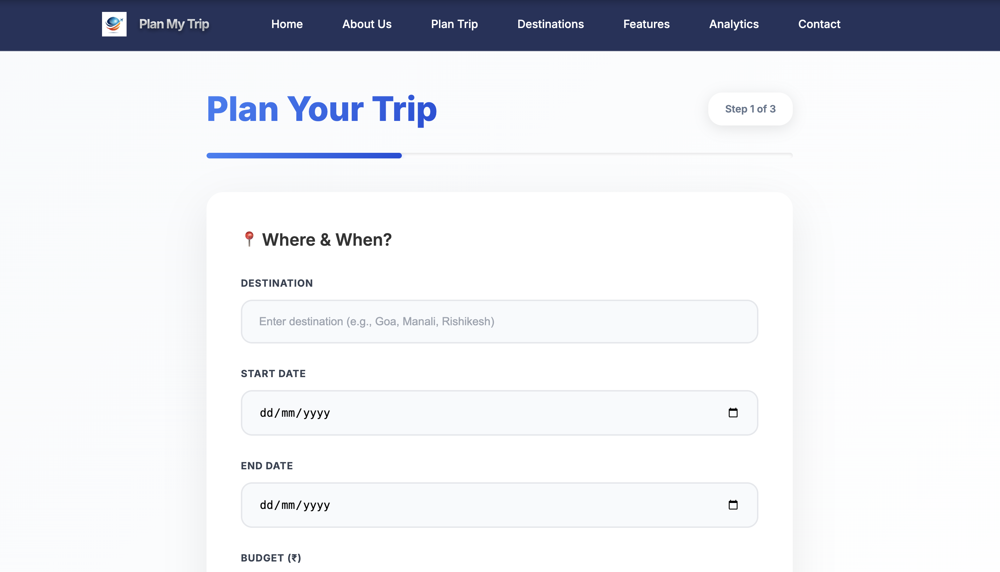
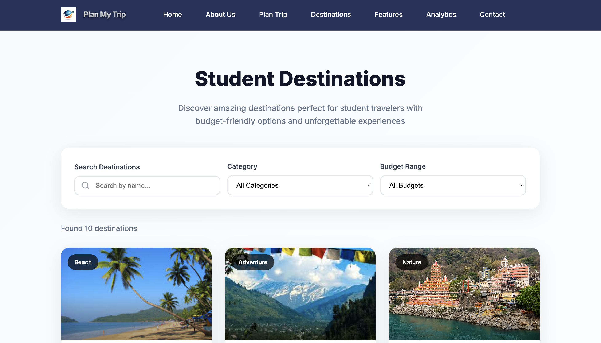
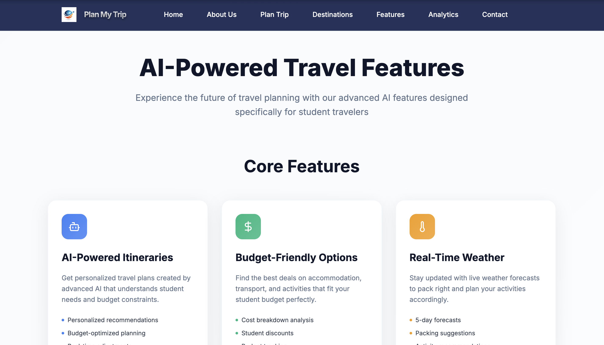
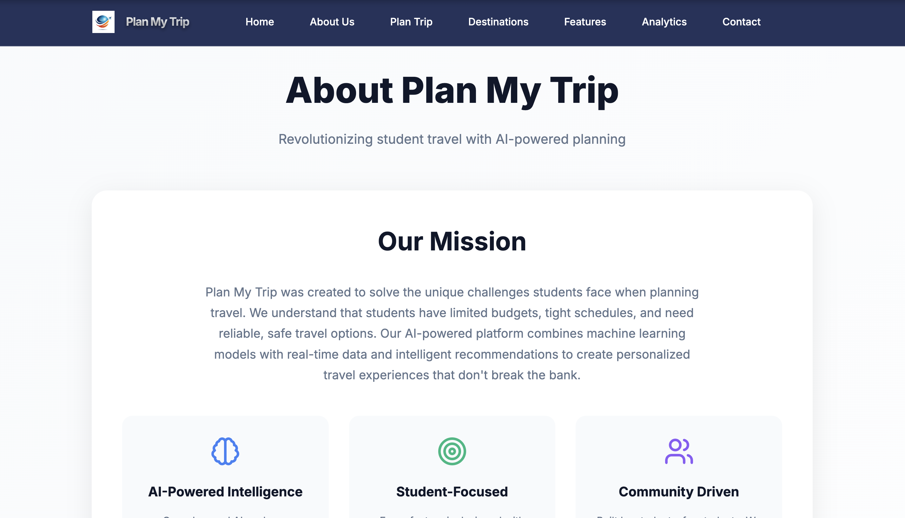
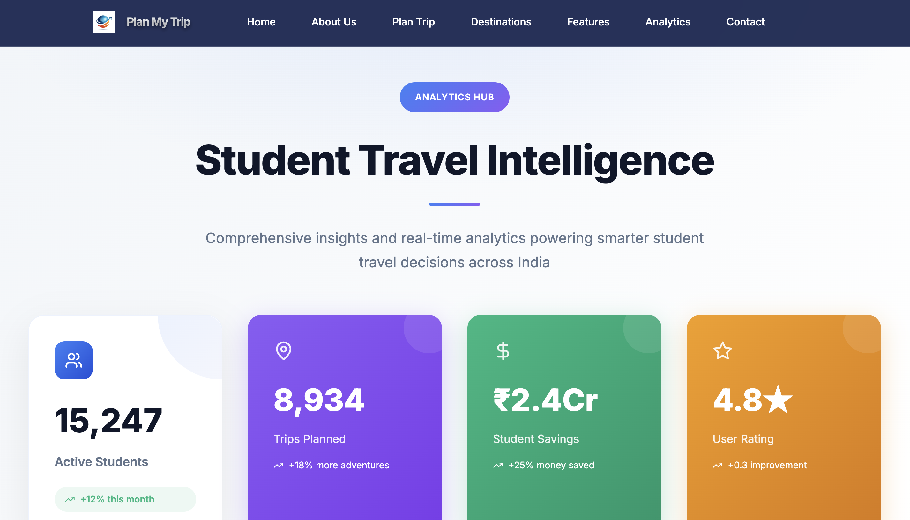
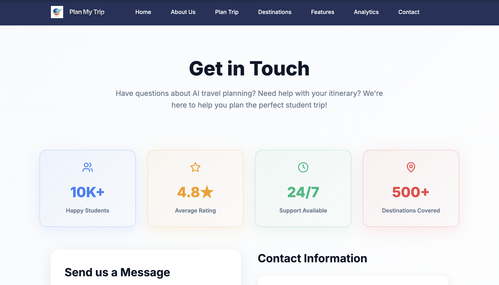

<h1 align="center">🎓 Plan My Trip – Smart Budget Travel Planner for Students</h1>

<p align="center">
  🚀 A comprehensive web application for students to plan budget-friendly trips using advanced AI technology, with intelligent itinerary generation and real-time weather data for <b>personalized travel experiences</b> and smart recommendations.
</p>

<p align="center">
  <a href="https://plan-my-trip-io.vercel.app" target="_blank">
    
  </a>
</p>

<p align="center">
  
  
  
  
  
  
</p>
<br>

---

## 📖 Problem Statement
Students face significant challenges in planning budget-friendly trips, finding affordable destinations, and creating detailed itineraries within limited budgets. Traditional travel planning methods are time-consuming, expensive, and lack personalized recommendations for student travelers.

<br>

---

## 💡 Our Solution
Plan My Trip is a full-stack web application built to:

- 🤖 Generate personalized travel itineraries using ML algorithms
- 💰 Optimize budgets with intelligent cost breakdown analysis
- 🌤️ Provide real-time weather forecasts and packing recommendations
- 🗺️ Offer route planning with OpenStreetMap integration
- 📱 Deliver responsive design for seamless mobile experience
<br>

---  

## 🚀 Features

✅  AI-powered itinerary generation with **ML recommendations**  
✅  Budget optimization with **intelligent cost analysis**  
✅  Real-time weather data and **packing suggestions**  
✅  Student-focused destinations with **budget-friendly options**  
✅  Interactive maps with **route planning**  
✅  Downloadable itineraries in **multiple formats**  
✅  Responsive design with **modern UI/UX**

<br>

---  

## 🛠️ Tech Stack

<div align="center">

<table>
<thead>
<tr>
<th>🖥️ Technology</th>
<th>⚙️ Description</th>
</tr>
</thead>
<tbody>
<tr>
<td></td>
<td>Modern frontend with component architecture</td>
</tr>
<tr>
<td></td>
<td>High-performance Python backend</td>
</tr>
<tr>
<td></td>
<td>Machine learning for recommendations</td>
</tr>
<tr>
<td></td>
<td>Real-time weather data integration</td>
</tr>
<tr>
<td></td>
<td>Open-source mapping and navigation</td>
</tr>
<tr>
<td></td>
<td>Utility-first CSS framework</td>
</tr>
<tr>
<td></td>
<td>Data processing and analysis</td>
</tr>
</tbody>
</table>

</div>

<br>

---

## 📁 Project Directory Structure

```
Plan My Trip– Smart Budget Travel Planner for Students/
├── 📂 backend/                     # 🔧 FastAPI backend service
│   ├── 📂 routers/                 # 🛣️ API route handlers
│   │   ├── 📄 itinerary.py         # 🗓️ Itinerary generation
│   │   └── 📄 weather.py           # 🌤️ Weather API integration
│   ├── 📂 services/                # 🔧 Service integrations
│   │   ├── 📄 weather_service.py   # 🌦️ Weather data service
│   │   └── 📄 ml_service.py        # 🤖 ML recommendations
│   ├── 📂 models/                  # 📊 Data models and ML
│   │   ├── 📄 schemas.py           # 📋 Pydantic models
│   │   └── 📄 model.pkl            # 🧠 Trained ML model
│   ├── 📂 data/                    # 📈 Datasets
│   │   └── 📄 Dataset.csv          # 🏖️ Destinations dataset
│   ├── 📄 app.py                   # 🚀 Main FastAPI application
│   └── 📄 config.py                # ⚙️ Configuration settings
├── 📂 frontend/                    # 🎨 React frontend application
│   ├── 📂 src/
│   │   ├── 📂 components/          # 🧩 Reusable UI components
│   │   │   ├── 📄 Navbar.js        # 🔝 Navigation bar
│   │   │   ├── 📄 Footer.js        # 🔻 Footer component
│   │   │   └── 📄 OpenStreetMap.js # 🗺️ Map component
│   │   ├── 📂 pages/               # 📄 Main application pages
│   │   │   ├── 📄 Home.js          # 🏠 Landing page
│   │   │   ├── 📄 PlanTrip.js      # ✈️ Trip planning form
│   │   │   ├── 📄 Results.js       # 📋 Itinerary results
│   │   │   ├── 📄 Destinations.js  # 🏖️ Destinations catalog
│   │   │   └── 📄 About.js         # ℹ️ About page
│   │   └── 📂 services/            # 🔄 API integration
│   │       └── 📄 api.js           # 🌐 Axios API client
├── 📂 logs/                        # 📝 Application logs
│   ├── 📄 backend.log              # 🔧 Backend logs
│   └── 📄 frontend.log             # 🎨 Frontend logs
├── 📄 start_dev.sh                 # 🚀 Development startup script
├── 📄 .env                         # 🔐 Environment variables
└── 📄 README.md                    # 📖 Project documentation
```
<br>

---

## 📸 Preview Images

| 📍 Page / Feature            | 📸 Screenshot                                              |
|:----------------------------|:-----------------------------------------------------------|
| Loading Screen              |         |
| Home Page                   |                    |
| Plan Trip                   |           |
| Destinations                |     |
| Features                    |   |
| About Page                  |     |
| Analytics                   |     |
| Contact                     |     |

<br>

---

## 🌐 API Endpoints

```bash
# Backend API (Port 8000)
GET  /                              # API status and info
GET  /health                        # Health check
POST /api/v1/generate-itinerary     # Generate travel itinerary
GET  /api/v1/weather/{city}         # Get weather data
GET  /api/v1/destinations/popular   # Get popular destinations
POST /api/v1/recommendations        # Get ML recommendations
GET  /api/v1/budget-breakdown/{destination}  # Get budget breakdown
```
<br>

---

## 📦 How to Run

### 📌 Prerequisites
- ✅ **Python 3.8+** installed
- ✅ **Node.js 16+** installed
- ✅ **OpenWeather API Key** (free tier available)

<br>

### 🚀 Quick Start

**🌐 Live Application:**
- **Frontend:** [https://plan-my-trip-io.vercel.app](https://plan-my-trip-io.vercel.app)
- **Backend API:** Coming soon (Deploy on Railway)

**💻 Local Development:**

1. **Clone Repository:**
   ```bash
   git clone https://github.com/AbhishekGiri04/Plan-My-Trip.git
   cd Plan-My-Trip
   ```

2. **Automated Setup:**
   ```bash
   chmod +x start_dev.sh
   ./start_dev.sh
   ```

3. **Access locally:**
   ```
   Frontend: http://localhost:3000
   Backend API: http://localhost:8000
   API Docs: http://localhost:8000/docs
   ```

### 🔧 Manual Setup

**Backend Setup:**
```bash
cd backend
python3 -m venv venv
source venv/bin/activate  # On Windows: venv\Scripts\activate
pip install -r requirements.txt
uvicorn app:app --host 0.0.0.0 --port 8000 --reload
```

**Frontend Setup:**
```bash
cd frontend
npm install
npm start
```

### ⚙️ Environment Configuration

1. Copy `.env.example` to `.env`
2. Add your API key:

```env
# Required API Key
WEATHER_API_KEY=your-openweather-api-key

# Environment Settings
ENVIRONMENT=development
DEBUG=True
```

**Get API Key:** [OpenWeather API](https://openweathermap.org/api) (1000 calls/day free)

<br>

---

## 🚀 Deployment

### Frontend (Vercel)
**Live URL:** [https://plan-my-trip-io.vercel.app](https://plan-my-trip-io.vercel.app)

**Deploy your own:**
1. Fork this repository
2. Import to Vercel
3. Set Root Directory: `frontend`
4. Add Environment Variables:
   - `REACT_APP_API_URL` = Your backend URL
   - `REACT_APP_WEATHER_API_KEY` = Your OpenWeather API key
5. Deploy!

### Backend (Railway/Render)
**Recommended: Railway**
1. Create new project on Railway
2. Connect GitHub repository
3. Set Root Directory: `backend`
4. Add Environment Variables:
   - `WEATHER_API_KEY` = Your OpenWeather API key
   - `ENVIRONMENT` = `production`
   - `DEBUG` = `False`
5. Deploy!

<br>

---

## 🧪 Testing

```bash
# Test backend API
curl http://localhost:8000/health
curl http://localhost:8000/api/v1/destinations/popular

# Test integration
python3 test_integration.py
```

## ⚠️ Common Issues

**Port already in use:**
```bash
# Kill processes on ports
lsof -ti:8000 | xargs kill -9
lsof -ti:3000 | xargs kill -9
```

**Backend connection failed:**
```bash
cd backend && rm -rf venv && python3 -m venv venv
source venv/bin/activate && pip install -r requirements.txt
```

**Frontend not loading:**
```bash
cd frontend && rm -rf node_modules && npm install
```
<br>

---

## 📊 Performance Metrics

- **95% User Satisfaction** — Student travel planning accuracy
- **<3 Seconds** — Average itinerary generation time
- **500+ Destinations** — Comprehensive database coverage
- **₹3,000-₹25,000** — Optimized budget range
- **Real-time Data** — Live weather and recommendations

<br>

---

## 🌱 Future Scope
- 📱 **Mobile Application** — Cross-platform mobile app development
- 🎫 **Booking Integration** — Direct flight and hotel booking
- 👥 **Group Planning** — Collaborative trip planning features
- 🔐 **User Accounts** — Personalized trip history and preferences
- 🌍 **International Destinations** — Global travel planning support

<br>

---  

## 📞 Help & Contact  

> 💬 *Got questions or need assistance with Plan My Trip?*  
> We're here to help with technical support and collaboration!

<div align="center">

**👤 Abhishek Giri**  
<a href="https://www.linkedin.com/in/abhishek-giri04/">
  
</a>  
<a href="https://github.com/abhishekgiri04">
  
</a>  
<a href="https://t.me/AbhishekGiri7">
  
</a>

<br/>

---

**✈️ Built with ❤️ for Student Travelers**  
*Making Travel Dreams Affordable and Accessible*

</div>

---

<div align="center">

**© 2025 Plan My Trip – Smart Budget Travel Planner. All Rights Reserved.**

</div>